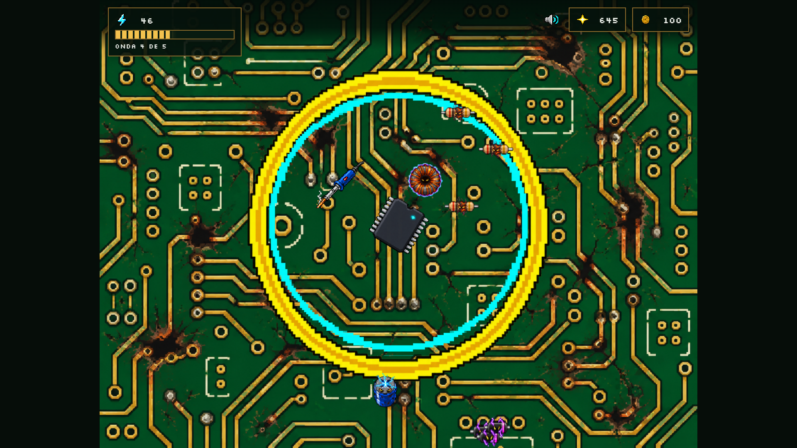
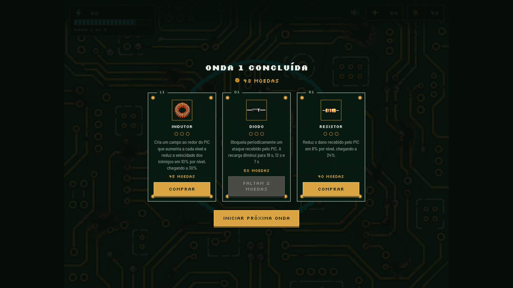
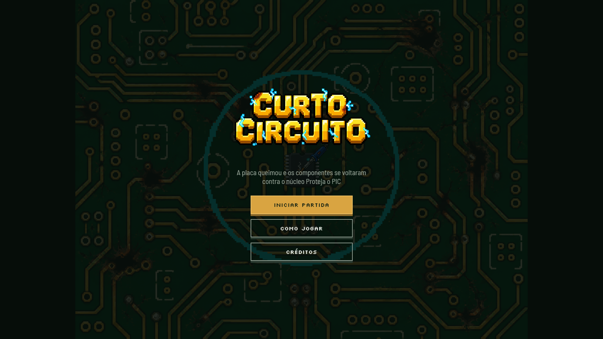

# CURTO-CIRCUITO

Jogo de defesa de torre 2D desenvolvido com JavaScript, WebGL2 e GLSL para a disciplina de Computação Gráfica.

- **Jogo:** https://guili-lopes.github.io/Trabalho-Pratico-1-CG-Tower-Defense/
- **Repositório:** https://github.com/Guili-Lopes/Trabalho-Pratico-1-CG-Tower-Defense

## O Jogo

Uma placa eletrônica sofreu um curto-circuito. Depois da falha, seus componentes se voltaram contra o núcleo principal da placa, um PIC localizado no centro do circuito.

Resistores queimados, capacitores sobrecarregados, indutores saturados, diodos invertidos e um transistor em avalanche avançam em direção ao PIC para destruí-lo.

O jogador representa o técnico responsável pela manutenção da placa. Enquanto o PIC se defende automaticamente disparando pulsos de PWM, o jogador utiliza um ferro de solda para clicar nos inimigos e causar dano adicional.

### Objetivo

Proteger o PIC durante cinco ondas de inimigos, comprar melhorias entre as ondas e derrotar o transistor em avalanche na última onda.

A partida termina em **vitória** quando o chefe é derrotado, e a placa aparece consertada. Termina em **derrota** quando a vida do PIC chega a zero: o PIC é substituído pela sua versão destruída e a tela de *game over* é exibida.

### O PIC

O PIC é a torre central do jogo. Ele permanece no centro da placa, **gira para mirar** no inimigo mais próximo dentro do seu alcance e dispara automaticamente pulsos de PWM contra ele. O alcance é exibido na tela como um anel. A direção do disparo é travada no momento do tiro, e o pulso desaparece ao acertar o primeiro inimigo.

| Atributo | Valor inicial |
|---|---|
| Vida | 100 |
| Alcance | 22 unidades |
| Dano por pulso | 13 |
| Cadência de disparo | 1,6 disparos por segundo |
| Velocidade do pulso | 60 unidades por segundo |

Ao final de cada onda, o PIC recupera 10 pontos de vida.

### O jogador

O jogador é representado por um ferro de solda, que substitui o cursor do mouse. Ao clicar sobre um inimigo, o jogador realiza uma solda e causa dano direto. O clique atinge apenas o inimigo visualmente à frente e possui tempo de recarga, para que o jogo não se resuma a clicar o mais rápido possível.

| Atributo | Valor inicial |
|---|---|
| Dano do clique | 12 |
| Tempo de recarga | 0,4 segundo |

### Inimigos

| Inimigo | Vida | Velocidade | Dano | Intervalo de ataque | Moedas | Pontos |
|---|---|---|---|---|---|---|
| Resistor queimado | 30 | 8 | 5 | 1,5 s | 6 | 10 |
| Capacitor sobrecarregado | 70 | 5 | 10 | 2,0 s | 12 | 25 |
| Indutor saturado | 80 | 5,5 | 4 | 1,5 s | 16 | 30 |
| Diodo invertido | 15 | 14 | 4 | 1,0 s | 6 | 8 |
| Transistor em avalanche | 450 | 4 | 25 | 2,5 s | 1000 | 300 |

Ao alcançar o PIC, o inimigo para de andar e passa a atacar em intervalos regulares até ser destruído.

**Resistor queimado.** Inimigo básico, com vida, velocidade e dano equilibrados. Aparece desde a primeira onda.

**Capacitor sobrecarregado.** Mais resistente e lento. Ao ser derrotado, libera uma descarga elétrica em área que atinge o PIC caso ele esteja dentro do raio, o que torna arriscado destruí-lo muito perto do centro.

**Indutor saturado.** Vida elevada e velocidade média. Possui um escudo magnético que reduz em 20% todo o dano recebido, tanto dos pulsos do PIC quanto dos cliques do ferro de solda.

**Diodo invertido.** Rápido e frágil. Surge sempre em bandos de três, entrando pelo mesmo ponto da borda.

**Transistor em avalanche.** Chefe da quinta onda, maior, mais resistente e visualmente diferente dos demais. Sua mecânica própria é a avalanche: ele acumula o dano que recebe e, ao passar de 150, entra por 3 segundos em um estado em que seu sprite muda para a versão sobrecarregada, sua velocidade triplica e seus golpes contra o PIC causam 40 de dano. Depois disso o acúmulo é zerado e ele volta ao comportamento normal. Atacá-lo, portanto, é justamente o que o torna perigoso.

### Melhorias

No intervalo entre ondas, o jogo sorteia três cartões de melhoria entre aquelas que ainda não chegaram ao nível máximo. O jogador compra quantas conseguir pagar entre as três oferecidas e depois escolhe quando iniciar a onda seguinte. As moedas que sobrarem permanecem para os próximos intervalos.

Cada melhoria pode ser adquirida até três vezes, e os bônus percentuais são aditivos.

| Melhoria | Preço | Efeito |
|---|---|---|
| **Resistor** | 40 | Reduz o dano recebido pelo PIC em 8% por nível, chegando a 24%. |
| **Capacitor** | 45 | Aumenta o dano do PIC em 13% por nível, chegando a 39%. A partir da primeira compra, a cada 10 disparos o PIC libera uma descarga em área que atinge os inimigos próximos, também afetada pelo bônus de dano. |
| **Indutor** | 45 | Cria um campo magnético ao redor do PIC, visível na placa. A cada nível o campo aumenta e reduz a velocidade dos inimigos dentro dele em mais 10%, chegando a 30%. |
| **Diodo** | 50 | Bloqueia periodicamente um ataque recebido pelo PIC. O intervalo de recarga diminui a cada nível: 18 s, 12 s e 7 s. |
| **Transistor** | 45 | Aumenta a cadência de disparo e a velocidade dos pulsos em 12% por nível, chegando a 36%. |
| **Ferro de solda** | 35 | Aumenta o dano causado pelos cliques em 25% por nível, chegando a 75%. |

Os cartões da loja mostram os componentes em estado íntegro, em contraste com as versões queimadas e sobrecarregadas que aparecem como inimigos.

### Ondas

O jogo possui cinco ondas. Cada onda é dividida em mini-grupos embaralhados separadamente, de modo que os inimigos mais fortes aparecem com mais frequência perto do final da onda, criando uma curva de tensão crescente dentro de cada uma.

| Onda | Composição |
|---|---|
| 1 | 8 resistores |
| 2 | 8 resistores, 4 capacitores |
| 3 | 9 resistores, 4 capacitores, 2 indutores |
| 4 | 12 resistores, 6 capacitores, 4 indutores, 2 bandos de diodos |
| 5 | 14 resistores, 7 capacitores, 5 indutores, 3 bandos de diodos e o transistor em avalanche ao final |

O intervalo entre os surgimentos diminui de 2 para 1 segundo ao longo de cada onda. A onda termina quando o último inimigo é derrotado, e a seguinte só começa quando o jogador decide iniciá-la.

### Pontuação e moedas

O jogo utiliza dois valores separados:

- **pontuação:** soma dos pontos de todos os inimigos derrotados, representando o desempenho total da partida. Nunca diminui;
- **moedas:** recebidas ao derrotar inimigos e gastas nas melhorias durante os intervalos entre ondas.

### Telas

Menu inicial, como jogar, créditos, jogo, pausa, loja de melhorias, *game over* e vitória.

### Controles

| Ação | Controle |
|---|---|
| Soldar um inimigo | Clique do mouse sobre o inimigo |
| Comprar melhoria | Clique no cartão da melhoria |
| Pausar ou continuar | P |
| Alternar tela cheia | F |
| Ativar ou desativar o som | M |
| Reiniciar após a derrota ou a vitória | R |

A tela de pausa também permite reiniciar a partida ou voltar ao menu.

### Tecnologias

- HTML;
- CSS;
- JavaScript;
- WebGL2;
- GLSL;
- GitHub Pages.

### Checklist dos itens obrigatórios

- [x] Torre que atira.
- [x] Condição de derrota com mensagem de *game over*.
- [x] Inimigos surgindo, andando, atacando a torre e sendo derrotados.
- [x] Clique "dedada" nos inimigos, representado pelo ferro de solda.
- [x] HUD com vida do PIC e pontuação.
- [x] Loop de reinício do jogo.
- [x] Uso de texturas.

## Criador

- **Nome:** Guilherme Lourenço Lopes
- **GitHub:** [Guili-Lopes](https://github.com/Guili-Lopes)
- **Contato:** guilhermellopes2004@gmail.com

## Screenshots

## Opcionais

Os itens abaixo foram escolhidos para o projeto. Aqueles marcados com `[x]` é aquilo que está funcionando na versão publicada.

- [ ] **Texturas animadas:** você pode criar animações de personagens ou cenário. Por exemplo, para inimigo andando, atacando... uma explosão, para os projéteis etc.

- [ ] **Efeitos de partículas** para simular explosão, faíscas etc.

- [x] **Telas:** faça um jogo completo, ou seja, implemente telas de *splash screen*, menu inicial, créditos, opções, *game over*, etc.

- [x] **Sons:** Colocar efeitos sonoros e música de fundo no seu jogo.

- [x] **Tela cheia:** faça com que seja possível colocar em tela cheia e que a razão de aspecto do jogo seja sempre mantida, independente das dimensões da janela (*windowed* ou *full screen*), mas que o jogo ocupe a maior área possível da janela e ficando centralizado.

- [x] **Inimigos diferentes:** faça inimigos visual e mecanicamente diferentes, como com velocidades distintas, frequência de ataque, dano etc.

- [x] **Inimigos em ondas:** crie o conceito de ondas de inimigos (fases) para que o jogador possa conciliar momentos de maior tensão ou maior relaxamento (no intervalinho entre ondas). As ondas podem ser "fases curadas" e finitas, ou infinitas (com aumento de dificuldade).

- [x] **Progressão da torre:** permita ao jogador melhorar a(s) torre(s) eventualmente, por exemplo, aumentando sua cadência, ou seu alcance, ou seu dano etc. Uma estratégia interessante é a adotada por jogos "roguelike" ou "roguelite", que é a ideia de oferecer umas 3x opções de *upgrade* aleatórios ao jogador cada vez que ele tiver a oportunidade de melhorar uma torre.

- [x] **Moedas:** crie uma moeda que o jogador adquire, de alguma forma, e que pode ser usada para: (a) melhorias na(s) torre(s), ou (b) criar novas torres, ou (c) para melhorias do herói, ou para outro motivo interessante.

- [x] **Implementação criativa:** qualquer implementação que não fuja muito do pedido, mas que traga elementos novos e interessantes para o seu jogo é bem-vinda!

## Créditos

### Desenvolvimento

- Programação e design do jogo: Guilherme Lourenço Lopes.

### Recursos de terceiros

| Recurso | Autor | Link | Licença |
|---|---|---|---|
| Textura da placa, PIC, inimigos, chefe, ícones de melhoria, ícones do HUD, logotipo, ferro de solda, moeda e efeitos | Gerados com ChatGPT (OpenAI) e processados manualmente por Guilherme Lopes | https://chatgpt.com | — |
| Sprites de explosão, fogo e raio | CraftPix.net | https://craftpix.net/freebies/11-free-pixel-art-explosion-sprites/ | CraftPix Freebie License |
| Fonte Silkscreen | Jason Kottke | https://fonts.google.com/specimen/Silkscreen | SIL Open Font License 1.1 |
| Fonte Barlow Semi Condensed | Jeremy Tribby | https://fonts.google.com/specimen/Barlow+Semi+Condensed | SIL Open Font License 1.1 |
| Música de fundo | João Manoel | — | — |
| Som de compra de melhoria | Luisa Reis Ribeiro | — | — |
| Som de início de onda | Matheus Huebra | — | — |
| Som de *game over* | Thiago Cury | — | — |
| Demais efeitos sonoros | Guilherme Lourenço Lopes | — | — |
